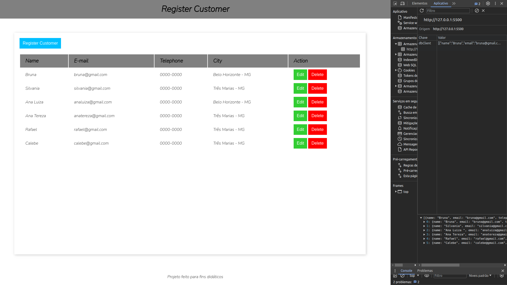

<h1 align="center"> To Do List - CRUD 📝 </h1>

# Sobre o projeto ✨
Esse é um projeto CRUD completo e básico no JavaScript, utilizando o localStorage como "banco de dados", coloquei em prática os conceitos básico de javascript, seguindo as boas práticas de programação em pequenas funções e funções puras.
O HTML e o CSS também foram feitos do 0 para aperfeiçoar minhas habilidades em ambos. 

# Como acessar o projeto? 🤔

Basta clicar [AQUI](https://analudms.github.io/ToDoList-CRUD/) que você será direcionado!

# Apresentação 👀

  

# Tecnologias 💻
- HTML e CSS.
- JavaScript.
- Git e Github.
- LocalHost

# Inspiração 💡

Projeto feito a partir de uma vídeo aula gratuita no canal Fernando Leonid no YouTube 📺. 
https://www.youtube.com/@FernandoLeonid
# Autor 👩🏻

Ana Luiza de Melo Soares.  
https://www.linkedin.com/in/ana-luiza-melo-8b94181b3/